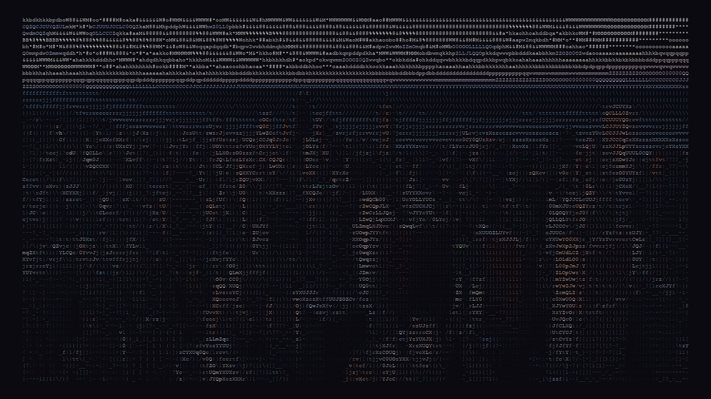
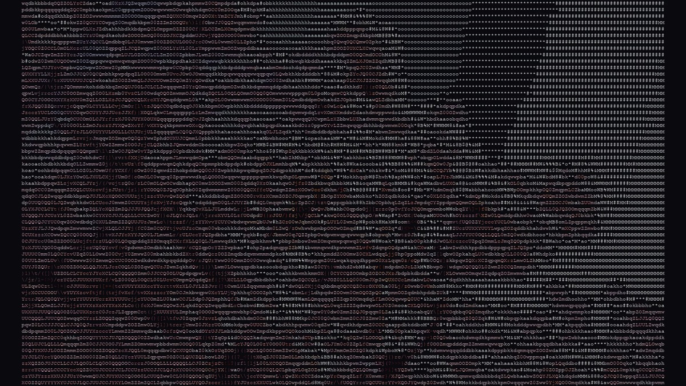
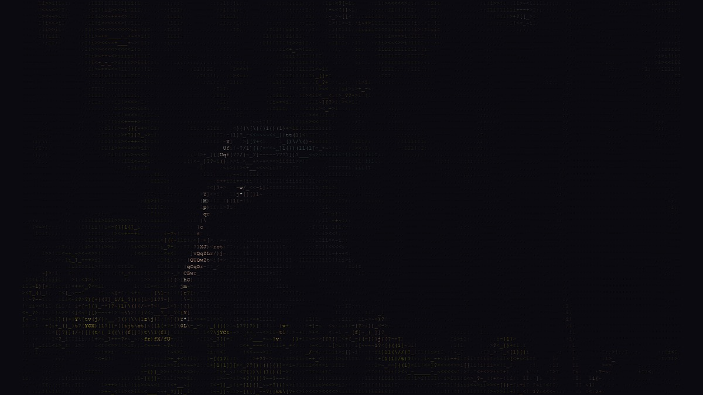
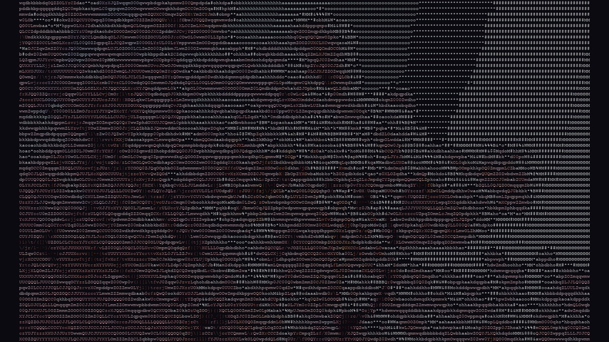
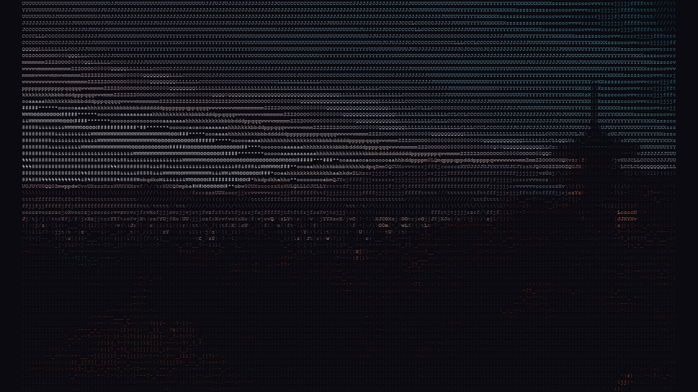

<picture>
  <source media="(prefers-color-scheme: dark)" srcset="assets/tokyo-cityscape.jpg">
  
</picture>

<div align="center">

<pre>
    ___       __            _____ __           __
   /   | ____/ /___ ___  __/ ___// /___  _____/ /__
  / /| |/ __  / __ `/ / / / \__ \/ / __ \/ ___/ //_/
 / ___ / /_/ / /_/ / /_/ /___/ / / /_/ / /__/ / ,<
/_/  |_|\__,_/\__,_/\__, //____/_/\____/\___/_/|_|
                  /____/
</pre>

# arjun shah

**14 · founder · developer · bay area**

*crafted software · ai agents · shipped fast*

<br>

[](https://arjunshah.xyz)
[](https://loopy.yachts)
[](https://supercompress.dev)
[](mailto:arjunkshah21@gmail.com)
[](https://x.com/arjunkshah21)
[](https://gitlab.com/arjunkshah)

</div>

<table align="center">
<tr>
<td align="center" width="20%"><strong>86</strong><br><sub>REPOS</sub></td>
<td align="center" width="20%"><strong>9</strong><br><sub>★ STARRED</sub></td>
<td align="center" width="20%"><strong>LISA</strong><br><sub>STANFORD GSB</sub></td>
<td align="center" width="20%"><strong>100+</strong><br><sub>IDEATR USERS</sub></td>
<td align="center" width="20%"><strong>124</strong><br><sub>ASCII GENS</sub></td>
</tr>
</table>

<br>

<div align="center">

**jump to** → [about](#about) · [journey](#journey) · [projects](#projects) · [ascii](#ascii) · [writing](#writing) · [connect](#connect)

</div>

---

<h2 id="about">about</h2>

<table>
<tr>
<td width="140" valign="top">

</td>
<td valign="top">

i am **arjun** — a 14-year-old developer and founder building software that scales.

i ship fast, iterate relentlessly, and make tools that feel **crafted**. quiet, intentional, powerful. not impressive in isolation — powerful in use.

currently building [**Loopy**](https://loopy.yachts) — a local agent company that keeps builds moving — plus **Supercompress**, **ascii-skill**, **Jasmine**, and everything around autonomous agents, context compression, and design taste.

→ **[arjunshah.xyz](https://arjunshah.xyz)** · **[writing](https://arjunshah.xyz)** · **[all repos →](https://github.com/arjunkshah12345-hash?tab=repositories)**

</td>
</tr>
</table>

---

<h2 id="journey">journey</h2>

```
2024          rooted.ai ──────────► Stanford GSB LISA winner
              │                    ancient health × modern AI
              ▼
2024–25       ideatr.dev ─────────► 100+ real active users
              │                    distribution, feedback, momentum
              ▼
2025–26       Loopy ───────────────► autonomous software engineer
              Supercompress ───────► neural context compression
              Jasmine ─────────────► AI design with taste
              ascii-skill ─────────► ASCII art for any agent
              Pincer ──────────────► dyslexia-friendly browsing
```

<table>
<tr>
<td width="110"><strong>2024</strong></td>
<td>

**[rooted.ai](https://rooted-ai.vercel.app)** — won **Stanford GSB LISA**. turned a question about health complexity into a product. learned to pitch, validate, and ship before certainty.

</td>
</tr>
<tr>
<td><strong>2024–25</strong></td>
<td>

**[ideatr.dev](https://github.com/arjunkshah12345-hash/ideatr)** — **100+ active users** in months. real people reshaped how i think about product and distribution. the first 100 users are collaborators.

</td>
</tr>
<tr>
<td><strong>now</strong></td>
<td>

**agents + compression + taste** — Loopy runs the build loop. Supercompress preserves signal under token pressure. Jasmine encodes design judgment. this GitHub is where it all lives.

</td>
</tr>
</table>

<p align="center">
  
</p>

---

<h2 id="projects">★ projects</h2>

> starred flagships with cover art — browse all 86 in **[PROJECTS.md](./PROJECTS.md)**

<table>
<tr>
<!-- row 1 -->
<td align="center" width="33%" valign="top">
<a href="https://gitlab.com/arjunkshah/loopy">
<br>
<strong>Loopy</strong></a><br>
<sub>autonomous software engineer</sub><br><br>
<a href="https://loopy.yachts">loopy.yachts ↗</a>
</td>
<td align="center" width="33%" valign="top">
<a href="https://github.com/arjunkshah12345-hash/supercompress">
<br>
<strong>Supercompress</strong></a><br>
<sub>neural context compression</sub><br><br>
<a href="https://supercompress.dev">supercompress.dev ↗</a>
</td>
<td align="center" width="33%" valign="top">
<a href="https://gitlab.com/arjunkshah/opencode-orchestration">
<br>
<strong>opencode orch</strong></a><br>
<sub>local agent dashboard</sub><br><br>
<a href="https://gitlab.com/arjunkshah/opencode-orchestration">repo ↗</a>
</td>
</tr>
<tr>
<!-- row 2 -->
<td align="center" width="33%" valign="top">
<a href="https://gitlab.com/arjunkshah/ascii-skill">
<br>
<strong>ascii-skill</strong></a><br>
<sub>world-class ASCII for agents</sub><br><br>
<code>npx skills add arjunkshah/ascii-skill</code>
</td>
<td align="center" width="33%" valign="top">
<a href="https://gitlab.com/arjunkshah/jasmine">
<br>
<strong>Jasmine</strong></a><br>
<sub>AI frontend with taste</sub><br><br>
<a href="https://tryjasmine.dev">tryjasmine.dev ↗</a>
</td>
<td align="center" width="33%" valign="top">
<a href="https://gitlab.com/arjunkshah/portfolio">
<br>
<strong>portfolio</strong></a><br>
<sub>arjunshah.xyz source</sub><br><br>
<a href="https://arjunshah.xyz">arjunshah.xyz ↗</a>
</td>
</tr>
<tr>
<!-- row 3 -->
<td align="center" width="33%" valign="top">
<a href="https://gitlab.com/arjunkshah/goalbuddy">
<br>
<strong>goalbuddy</strong></a><br>
<sub>goal tracking companion</sub>
</td>
<td align="center" width="33%" valign="top">
<a href="https://gitlab.com/arjunkshah/brutal-ui">
<br>
<strong>brutal-ui</strong></a><br>
<sub>brutalist component library</sub>
</td>
<td align="center" width="33%" valign="top">
<a href="https://gitlab.com/arjunkshah/neural-organism-in-a-jar">
<br>
<strong>neural organism</strong></a><br>
<sub>evolving NN · raspberry pi</sub>
</td>
</tr>
</table>

<br>

<table width="100%">
<tr>
<td width="50%" valign="top">

**also building**

| project | link |
|:--------|:-----|
| Pincer — dyslexia-friendly Chrome ext | [trypincer.netlify.app](https://trypincer.netlify.app) |
| ideatr — website → React app | [github](https://github.com/arjunkshah12345-hash/ideatr) |
| loopy-mac-app — SwiftUI client | [gitlab](https://gitlab.com/arjunkshah/loopy-mac-app) |
| design-skill — taste for agents | [gitlab](https://gitlab.com/arjunkshah/design-skill) |

</td>
<td width="50%" valign="top">

**browse by topic**

| tag | what's there |
|:----|:-------------|
| `ai-agents` | Loopy, skills, orchestration |
| `compression` | Supercompress, token tools |
| `design` `ui` | Jasmine, brutal-ui |
| `impact` | rooted.ai, LISA |
| `experiments` | neural organism, sims |
| `archive` | tests & early builds |

</td>
</tr>
</table>

---

<h2 id="ascii">ascii — reimagined</h2>

<p align="center">
  
  
  
</p>
<p align="center">
  
  
</p>

<table align="center">
<tr>
<td align="center" width="25%"><strong>124</strong><br><sub>GENERATORS</sub></td>
<td align="center" width="25%"><strong>420+</strong><br><sub>KEYWORDS</sub></td>
<td align="center" width="25%"><strong>15</strong><br><sub>STYLES</sub></td>
<td align="center" width="25%"><strong>14</strong><br><sub>PALETTES</sub></td>
</tr>
</table>

<p align="center">
  <a href="https://gitlab.com/arjunkshah/ascii-skill"><strong>→ get ascii-skill</strong></a>
  &nbsp;·&nbsp;
  <code>npx skills add arjunkshah/ascii-skill</code>
</p>

---

<h2 id="philosophy">how i build</h2>

```
┌────────────────────────────────────────────────────────────────────┐
│  SHIP FAST     smallest thing that proves the idea                 │
│  LEARN DAILY   every release turns guesses into knowledge          │
│  CRAFTED       taste is spacing, type, motion — the invisible layer│
│  AGENTS FIRST  tools for agents that run hours, not minutes        │
│  MOMENTUM      tight loops compound                                │
└────────────────────────────────────────────────────────────────────┘
```

---

<h2 id="writing">writing</h2>

| essay | topic |
|:------|:------|
| [*i built supercompress*](https://arjunshah.xyz) | context compression for long-running agents |
| [*why jasmine exists*](https://arjunshah.xyz) | AI UI lacks taste — structure without judgment |
| [*scaling to 100 users*](https://arjunshah.xyz) | ideatr.dev — distribution & feedback loops |
| [*winning stanford gsb lisa*](https://arjunshah.xyz) | rooted.ai, pitching, curiosity over credentials |
| [*the elegance of shipping fast*](https://arjunshah.xyz) | speed compounds, iteration beats big launches |

---

<h2 id="stack">stack</h2>

`typescript` · `python` · `swift` · `react` · `next.js` · `tailwind` · `framer motion` · `swiftui` · `neural nets` · `agent orchestration` · `terminal UI` · `product design`

---

<h2 id="connect">connect</h2>

<div align="center">

| [arjunshah.xyz](https://arjunshah.xyz) | [arjunkshah21@gmail.com](mailto:arjunkshah21@gmail.com) | [@arjunkshah21](https://x.com/arjunkshah21) |
|:---:|:---:|:---:|
| [github.com/arjunkshah](https://github.com/arjunkshah12345-hash) | [gitlab.com/arjunkshah](https://gitlab.com/arjunkshah) | [linkedin](https://www.linkedin.com/in/arjun-k-shah) |

<br>

*i'm always open to talking about startups, AI, product design, or agents.*

<br>

<sub>signed, a.s. · banner from the <a href="https://gitlab.com/arjunkshah/ascii-skill">ascii-skill launch reel</a></sub>

</div>
