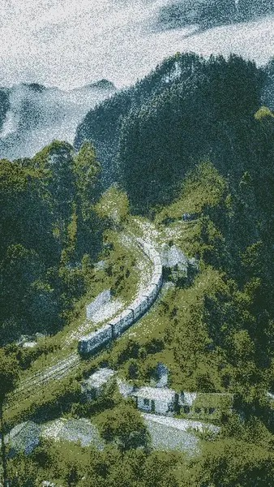

### hi, i'm arjun.

i'm 14 and i build software in san jose. right now i'm working on [**supercompress**](https://supercompress.dev), an open-source context compression tool for ai agents.

→ [arjunshah.xyz](https://arjunshah.xyz) · [blog](https://arjunshah.xyz/blog) · [art](https://arjunshah.xyz/art) · [socials](https://arjunshah.xyz/socials)

---

### highlighted projects

| project | what it is |
| :--- | :--- |
| [**loopy**](https://loopy.yachts) | an autonomous software engineer — researches, plans, builds, loops until done |
| [**supercompress**](https://supercompress.dev) | context compression for long-running ai agents |
| [**ditherstudio**](https://ditherstudio.ideatr.dev) | dither any image in the browser |
| [**ascii-skill**](https://github.com/arjunkshah12345-hash/ascii-skill) | ascii art for ai agents |
| [**NEAT flappy bird**](https://github.com/arjunkshah12345-hash/NEAT-Flappy-Bird) | neuroevolution learns to play flappy bird — my favorite project |
| [**typing club bot**](https://github.com/arjunkshah12345-hash/Typing-Club-Bot) | typing club automation / practice utilities |

---

### art

dithered studies of places, movement, color, and gods — made with [ditherstudio](https://ditherstudio.ideatr.dev). full set on [arjunshah.xyz/art](https://arjunshah.xyz/art).

  
  
  
  

  
  
  
  

01 road home · 02 stillness · 03 mahadev · 04 motion · 05 quiet peaks · 06 san francisco · 07 pink bank · 08 liftoff

---

### the journey so far

| age | |
| ---: | :--- |
| **7** | found coding through tynker and started learning python. |
| **9** | rage quit because syntax kept getting between the idea and the thing. |
| **12** | came back as a vibe coder. ai made building feel like possibility again. |
| **13** | built saas products, trained neural networks, and won stanford gsb lisa with rooted.ai. |
| **14** | podium at chamath's 8090 hackathon; 2nd at composio + nebius builders ship; $20k e2b credits; built loopy, supercompress, ascii-skill, pincer, jasmine, and ditherstudio. |
| **now** | building infrastructure for agents that can work longer, remember better, and make software that feels intentional. |

---

### latest writing

- [**why i code: from python to ai agents**](https://arjunshah.xyz/blog/why-i-code) — started at seven, quit at nine, returned at twelve, and haven't really stopped since.
- [**i built supercompress**](https://arjunshah.xyz/blog/supercompress) — long-running agents don't need more prompts. they need better memory.
- [**building loopy: an autonomous software engineer**](https://arjunshah.xyz/blog/loopy) — what if an agent could build a real product from a single idea—and keep going after the demo?

---

### connect

[x/twitter](https://x.com/arjunkshah21) · [gitlab](https://gitlab.com/arjunkshah) · [github](https://github.com/arjunkshah12345-hash) · [linkedin](https://www.linkedin.com/in/arjun-k-shah) · [email](mailto:arjunkshah21@gmail.com)

san jose, california
